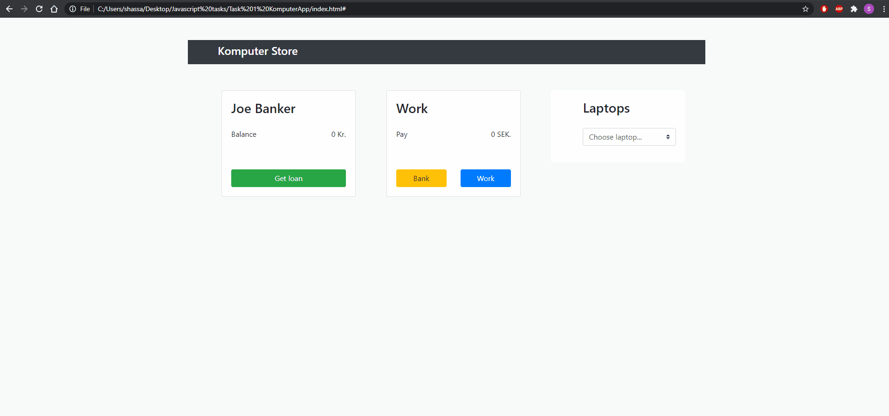

# Komputer-app
This is a project is a webshop which use frontend technologies like html, Bootstrap, and javascript and JSON.

# Features 
- The user has the possibility to work and earn 100 SEK for everytime he click on the button work. 
- The user has the possibility to transfer his money to his bankaccount. 
- The user has the possibility to borrow money from the bank. As a maximum, he can borrow twice as much as he has in his balance. 
- The user has the possibility to buy different laptop. 

# Usage:

